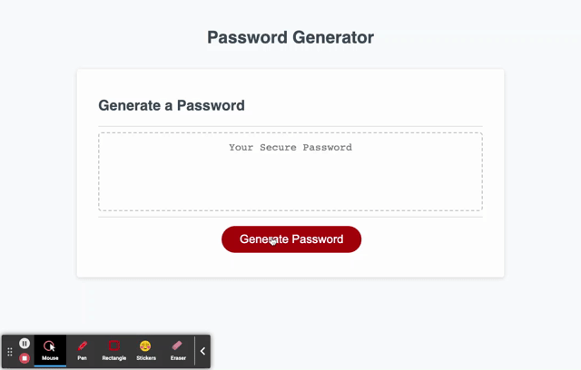

# Module 3 Challenge: Javascript Password Generator

## Description

I created an application that generates a random password based on criteria that the user selects. Using a random password generator provides greater security for user accounts that have access to sensitive data.

Click [here](https://sieraford.github.io/js-password-generator-siera/) to view the application.

## Screenshots

## Installation

N/A

## Usage

When you visit the application, you will be presented with a random password generator. When you click the generator password button, you are presented with a series of prompts for password criteria. You will be asked for the length of the password (must be at least 8 characters and no more than 128 characters) and whether or not to include lowercase, uppercase, numberic and/or special characters. If you write something other than "Y" or "N" you will be asked to try again and you must enter "Y" for at least one character type. The password will generated based off your inputs and will be displayed inside the dashed box.

## Credits

N/A

## License

N/A
